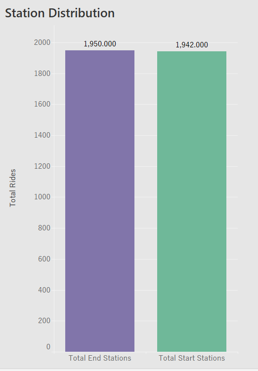
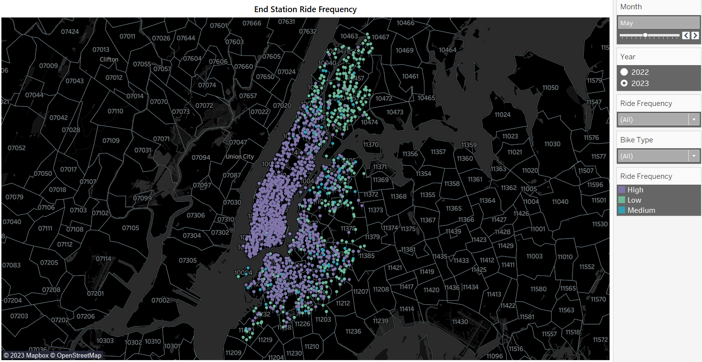
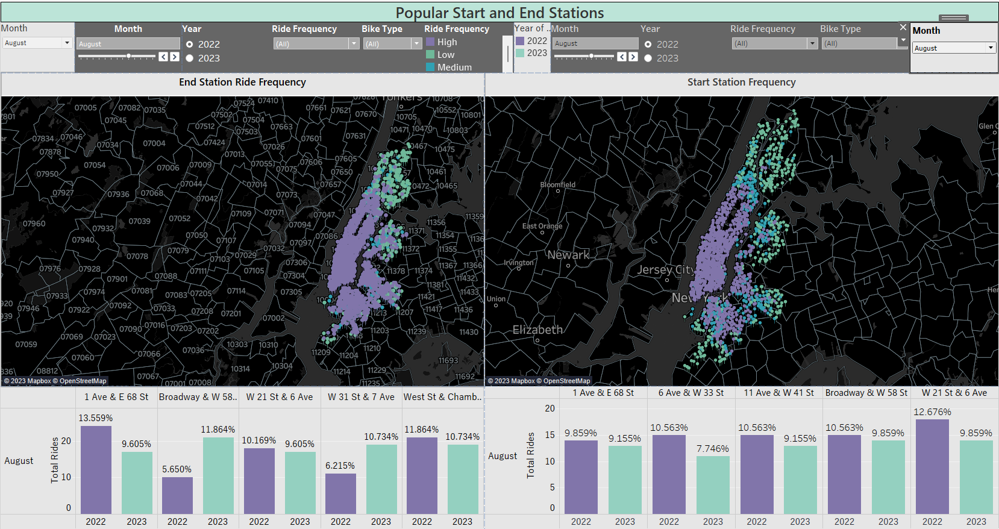

# Citibike Analysis
  
## Overview  
[The New York Citi](https://en.wikipedia.org/wiki/Citi_Bike) Bike program is the largest bike-sharing program in the United States. The main objective of this project is to generate regular reports for city officials to help promote and enhance the program.

Since 2013, the Citi Bike program has established a reliable infrastructure for capturing data on the program's usage. Every month, data on the bikes is collected, organized, and made available on the [Citi Bike Data](https://citibikenyc.com/system-data) webpage. However, while the data is consistently updated, the team has yet to develop a dashboard or a sophisticated reporting system. As a result, city officials have inquiries about the program, and the first task is to create a set of data reports that can provide the necessary answers.

## Requirements
### Map 
- Markers for all bike stations
- Station markers indicate popularity by color, size, shape, or some other means
- Ability to change marker data based on month and year
- Sections are marked by zip code
- A write-up on the trends that were discovered while making the map
### Visualizations 
- 4-10 total visualizations
- A total of 2 Tableau dashboards, each dedicated to a specific data discovery
- Dashboards are named appropriately
- Data is cleaned such that data entry errors are removed and columns are correctly typed
- Visualizations can logically be used to explore the data
### Tableau Story 
- Individual visualizations are used
- Dashboards are used
- A map is used
- Visualizations on the same page are clearly related to one another
- The story is informative and easy to navigate
### Analysis 
- Analysis is written in a markdown file or included in the Tableau Public workbook
- Analysis describes the dashboards and any interesting data discoveries contained within them
- Analysis on the chosen city official requested map detailing any noticeable trends
- The written analysis references specific visualizations and interactive features
- The document is written in a manner that a non-technical reader could understand.  

### Map:
- Lets begin analysis by examining the distribution  of all stations in our dataset.
   
- We have a total of 3892 stations, 1950 of which are end stations and 1942 are start stations.    
Here is a map showing the end stations:   

-  The map features various data points of different colors indicating the frequency of bike rides. The colors signify:
    - High frequency: for stations with more than 50 bike rides
    - Medium frequency: for stations with more than 25 but less than 50 bike rides
    - Low frequency: for stations with less than 25 bike rides
- This map can be further filtered by month, year, and the type of bike ridden by the user.
- The dataset period ranges from January 2022 to September 2023.
- Users can select a specific frequency they want to view, such as high frequency, by selecting the appropriate filter
- From the image we can deduce that Urban areas have a higher frequency of bikes.
- Additionally, when creating the map, we noticed a lower count of docked bikes.  
- Overall, classic bikes have the highest number, accounting for 77.83%, followed by electric bikes, which constitute 21.6%, and lastly docked bikes.  

### Analysis:
- Let's dive deep and understand any noticeable trends and interesting data discoveries.  
- Here is a dashboard comapring start and end stations:
      
- The above dashboard 
    