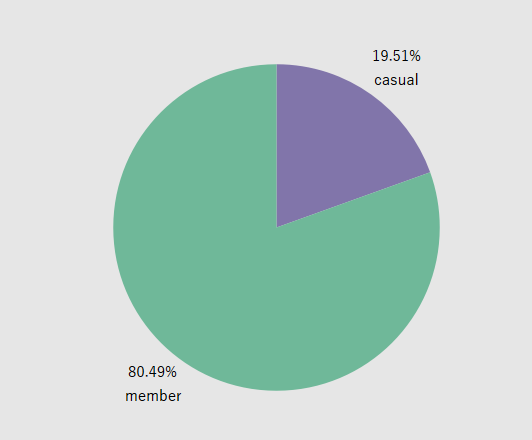
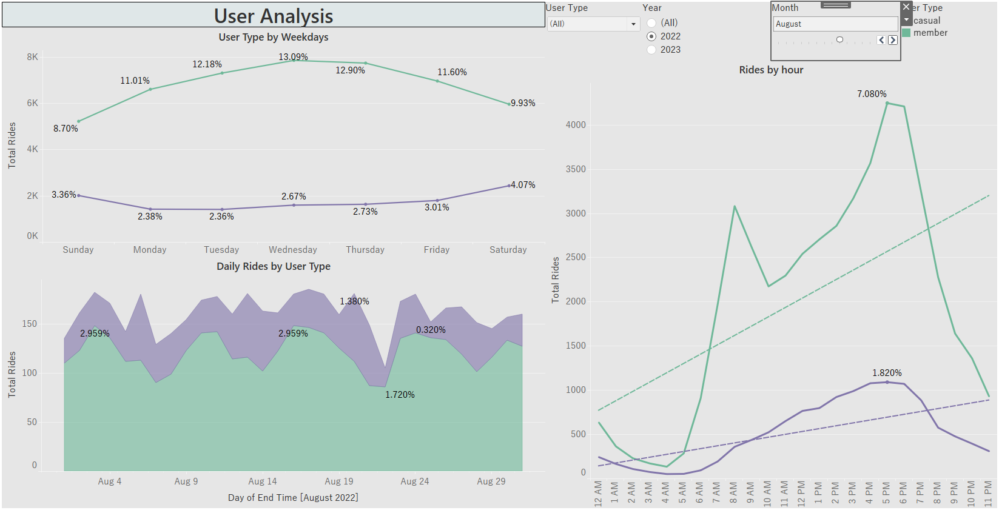
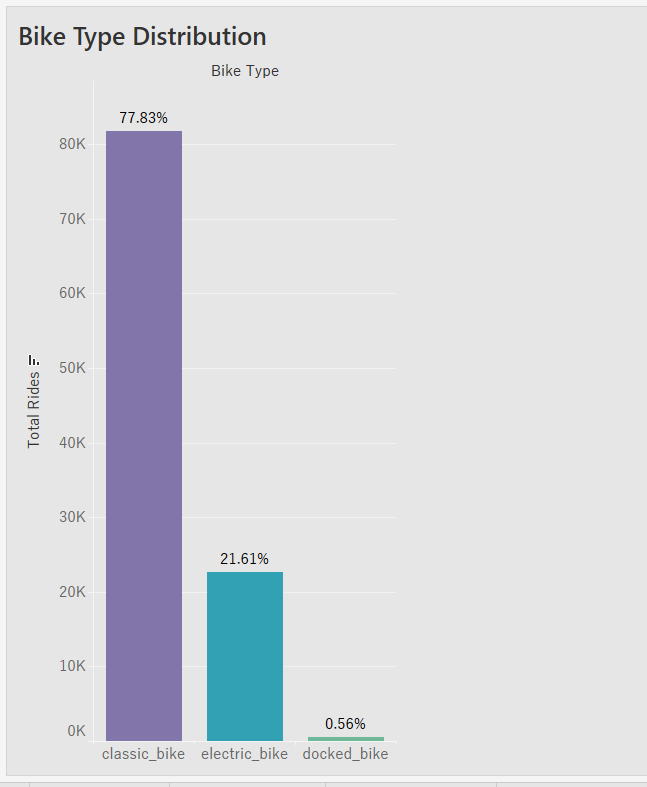
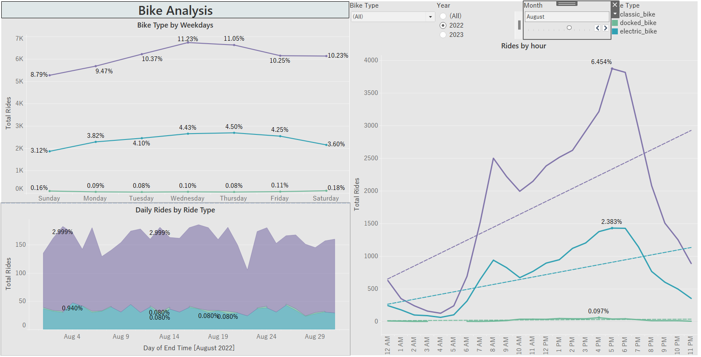
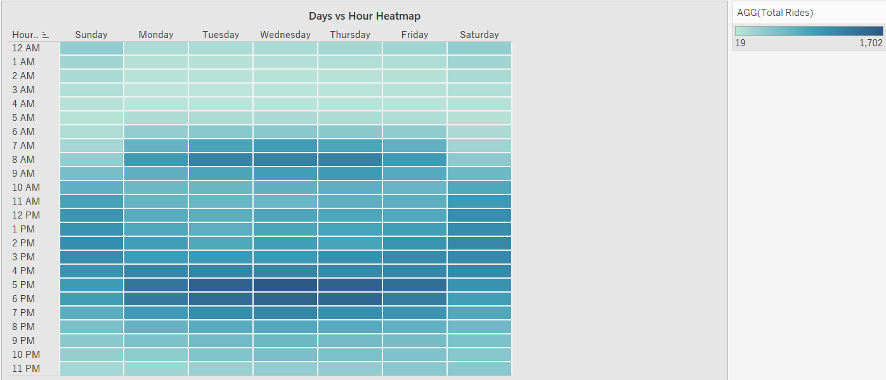

# Citibike Analysis
  
## Overview  
[The New York Citi](https://en.wikipedia.org/wiki/Citi_Bike) Bike program is the largest bike-sharing program in the United States. The main objective of this project is to generate regular reports for city officials to help promote and enhance the program.

Since 2013, the Citi Bike program has established a reliable infrastructure for capturing data on the program's usage. Every month, bike data is collected, organized, and made available on the [Citi Bike Data](https://citibikenyc.com/system-data) webpage. However, while the data is consistently updated, the team has yet to develop a dashboard or a sophisticated reporting system. As a result, city officials have inquiries about the program, and the first task is to create a set of data reports that can provide the necessary answers.
The link to the Tableau workbook can  be found [here](https://public.tableau.com/views/2022_2023_citibike/Citibike-Analysis?:language=en-US&publish=yes&:display_count=n&:origin=viz_share_link)  

## Data Processing
- The CSV files were downloaded from the [Citi Bike Data](https://s3.amazonaws.com/tripdata/index.html).
- I downloaded 21 different files accounting for each month for the years 2022 and 2023, cleaned and created a subset of the datasets since they are large and Tableau restricts data file size to 1GB. 
- These csvs were then combined based on year using `concat` and then exported as csvs to be used in Tableau.
- For data visualization in Tableau, the two cleaned and merged CSVs were combined using the union feature.

## Requirements
### Map 
- Markers for all bike stations
- Station markers indicate popularity by color, size, shape, or some other means
- Ability to change marker data based on month and year
- Sections are marked by zip code
- A write-up on the trends that were discovered while making the map
### Visualizations 
- 4-10 total visualizations
- A total of 2 Tableau dashboards, each dedicated to a specific data discovery
- Dashboards are named appropriately
- Data is cleaned such that data entry errors are removed and columns are correctly typed
- Visualizations can logically be used to explore the data
### Tableau Story 
- Individual visualizations are used
- Dashboards are used
- A map is used
- Visualizations on the same page are related to one another
- The story is informative and easy to navigate
### Analysis 
- Analysis is written in a markdown file or included in the Tableau Public workbook
- Analysis describes the dashboards and any interesting data discoveries contained within them
- Analysis of the chosen city official requested map detailing any noticeable trends
- The written analysis references specific visualizations and interactive features
- The document is written in a manner that a non-technical reader could understand.  

### Map:
- Let's begin the analysis by examining the distribution  of all stations in our dataset.
   
- We have a total of 3892 stations, 1950 of which are end stations and 1942 are start stations.    
Here is a map showing the end stations:   

-  The map features various data points of different colors indicating the frequency of bike rides. The colors signify:
    - High frequency: for stations with more than 50 bike rides
    - Medium frequency: for stations with more than 25 but less than 50 bike rides
    - Low frequency: for stations with less than 25 bike rides
- This map can be further filtered by month, year, and the type of bike the user rides.
- The dataset period ranges from January 2022 to September 2023.
- Users can select a specific frequency they want to view, such as high frequency, by selecting the appropriate filter
- From the image we can deduce that Urban areas have a higher frequency of bikes.
- Additionally, when creating the map, we noticed a lower count of docked bikes.  
- Overall, classic bikes have the highest number, accounting for 77.83%, followed by electric bikes, which constitute 21.6%, and lastly docked bikes.  

### Analysis:
#### Stations
- Let's dive deep and understand any noticeable trends and interesting data discoveries.  
- Here is a dashboard comparing start and end stations:
      
- The dashboard above displays the most popular stations for August 2022. Below the maps, there's a bar plot that shows the top 5 stations per month, grouped by year.
- from the map we can see that the end stations have a higher frequency of rides than the start stations, while in terms of popularity, Midtown Manhattan is the most popular. Many people might use it to commute. 
- When we look at the bar plots comparing years, it's evident that in August, the most popular start station was 1 Ave & E 68 St and all the start stations performed better for 2022.
- For the end stations, 3 performed better for the year 2022 and the top performing station was 1 Ave & E 68 St.
#### Users
- Let's look at our users and their distribution

- In our dataset, 80.49% of users are members and 19.51% are casual.

- We also have a dashboard to analyze users.
- With this dashboard, we can determine that the most popular weekday among users is Wednesday, the most popular day for August 2022 was the 20th, and the most popular hour was 5 p.m.
- There is also an upward trend for both causal users and members.
#### Bike Type

- The most popular bike type is the classic bike but this could also be because they are the highest in number accounting for 77.83% of the total bikes.

### Conclusions:
In this analysis we looked at August 2022, based on these observations we can conclude that
- There is a trend of higher frequency in more urban areas possibly due to users commuting which also coincides with a higher traffic at around 5 pm.
- This can be observed in a heatmap plotted with time against weekdays.

### Credits
- Debugging: ASKBcs
- References: [Royal Dsouza](https://public.tableau.com/app/profile/royal.dsouza/viz/Citibikeanalysis_16253027742710/HOME)
              [Reza Abasaltian](https://public.tableau.com/app/profile/reza.abasaltian/viz/CitiBike-Analysis_16086782951480/BikeId-Usage-Hi)
